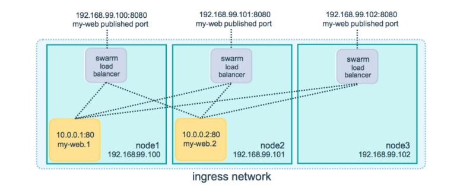

## docker容器集群管理系统之swarm

#### Docker容器集群管理主流方案

**Swarm**
Docker公司自研发的集群管理系统。
**Kubernetes**
Google开源的一个容器集群管理系统，用于自动化部署、扩展和管理容器应用。也称为K8S
**Mesos**
Mesos是一个集群资源调度系统，对集群中的资源进行分配和管理。Marathon是运行在Mesos之上的一个服务管理框架，可管理容器生命周期。

**Swarm、Kubernetes和Mesos简单比较：**
**复杂性**
Swarm使用标准Docker接口，集成于Docker Engine，内置Overlay网络、服务发现、负载均衡，很容易上手，学习成本低。K8S成熟且复杂，自己的管理体系，服务发现，负载均衡等功能，学习成本高。
Mesos是一个成熟分布式资源管理框架，一个通用的集群管理系统。
**功能**
Swarm支持Docker Compose v3来实现服务编排。
K8S强大的功能，有着一套整体容器解决方案，使用起来更轻松。
**社区活跃度**
K8S社区相比Swarm和Mesos活跃度都高。


#### Swarm介绍

##### Swarm是什么？

Swarm是Docker公司自研发的容器集群管理系统，Swarm在早期是作为一个独立服务存在，在Docker Engine v1.12中集成了Swarm的**集群管理**和**编排功能**。可以通过初始化Swarm或加入现有Swarm来启用Docker引擎的Swarm模式。
Docker Engine CLI和API包括了管理Swarm节点命令，比如添加、删除节点，以及在Swarm中部署和编排服务。
也增加了 **服务栈（Stack）、服务（Service）、任务（Task）** 概念。

##### Swarm两种角色：

**Manager**：接收客户端服务定义，将任务发送到worker节点；维护集群期望状态和集群管理功能及Leader选举。默认情况下manager节点也会运行任务，也可以配置只做管理任务。
**Worker**：接收并执行从管理节点分配的任务，并报告任务当前状态，以便管理节点维护每个服务期望状态。


Swarm特点：

```tex
1.Docker Engine集成集群管理
使用Docker Engine CLI创建一个Docker Engine的Swarm模式，在集群中部署应用程序服务。
2.去中心化设计
Swarm角色分为Manager和Worker节点，Manager节点故障不影响应用使用。
3.扩容缩容
可以声明每个服务运行的容器数量，通过添加或删除容器数自动调整期望的状态。
4.期望状态协调
Swarm Manager节点不断监视集群状态，并调整当前状态与期望状态之间的差异。例如，设置一个服务运行10个副本容器，如果两个副本的服务器节点崩溃，Manager将创建两个新的副本替代崩溃的副本。并将新的副本分配到可用的worker节点。
5.多主机网络
可以为服务指定overlay网络。当初始化或更新应用程序时，Swarm manager会自动为overlay网络上的容器分配IP地址。
6.服务发现
Swarm manager节点为集群中的每个服务分配唯一的DNS记录和负载均衡VIP。可以通过Swarm内置的DNS服务器查询集群中每个运行的容器。7.负载均衡
实现服务副本负载均衡，提供入口访问。也可以将服务入口暴露给外部负载均衡器再次负载均衡。
8.安全传输
Swarm中的每个节点使用TLS相互验证和加密，确保安全的其他节点通信。
9.滚动更新
升级时，逐步将应用服务更新到节点，如果出现问题，可以将任务回滚到先前版本。
```

#### 集群部署及节点管理

```tex
使用swarm前提：
Docker版本1.12+
集群节点之间保证TCP 2377、TCP/UDP 7946和UDP 4789端口通信
节点规划：
操作系统：Ubuntu 16.04_x64
管理节点：192.168.1.110
工作节点：192.168.1.111
工作节点：192.168.1.112
管理节点初始化swarm：
dockerswarm init--advertise-addr192.168.1.110
工作节点加入swarm：
docker swarm join--tokenSWMTKN-1-XXX 192.168.1.110:2377
注：上面那条命令具体执行可以使用docker swarm join-token manager/worker 来复制执行
```

#### 服务管理

```shell
#创建服务
docker service create --replicas 1 --name hello busybox
#显示服务详细信息
docker service inspect --pretty hello  #易于阅读显示
docker service inspect hello	# json格式返回
#若创建服务后没运行命令docker则自动关闭，可以执行下面命令
docker service update --args "ping www.baidu.com"  hello 
#扩展服务实例数
docker service scale hello=3
#查看服务任务
docker service ls
docker service ps hello
docker service ps -f 'desired-state=running' hello 	#过滤出正在运行的容器
```

```shell
#滚动更新服务
docker service create \
--replicas 3 \
--name redis \
--update-delay 10s \
redis:3.0.6
#手动更新
docker service update --image redis:3.0.7 redis
#创建服务时设定更新策略
dockerservice create \
--name my_web \
--replicas 10 \
--update-delay 10s \		#间隔时间 （10s）
--update-parallelism 2 \	#可以同时更新的进程（2）
--update-failure-action continue \	#创建失败后的操作 （维持原状）
nginx:1.12
```

```shell
#创建服务时设定回滚策略	注：在centos7 docker Version: 1.13.1中无回滚相关参数
docker service create \
--name my_web \		#名称
--replicas 10 \		#副本数量
--rollback-parallelism 2 \	
--rollback-monitor 20s \ 	#回滚监控时长（20s）
--rollback-max-failure-ratio .2 \	#最大失败数量（20%）
nginx:1.12
#服务更新
docker service update --image nginx:1.13 my_web
#手动回滚
docker service update --rollback my_web
```

#### 使用原生OverlayNetwork

```shell
#创建overlay网络
docker network create --driver overlay my-network
#创建新服务并使用overlay网络
docker service create \
--replicas 3 \
--network my-network \
--name my-web \
nginx
#将现有服务连接到overlay网络
docker service update -network -add my-network my-web
#删除正在运行的服务网络连接
docker service update --network -rm my-network my-web
```

#### 数据持久化

```shell 
#安装nfs ubuntu下为自动启动
sudo apt-get install nfs-kernel-server nfs-common portmap
#安装nfs centos7下通过下面命令手动启动
yum -y install nfs-utils
systemctl start rpcbind.service
systemctl start nfs.service
systemctl enable rpcbind.service
systemctl enable nfs.service
```

**1.volume**

```shell
#创建数据卷
docker service create\
--mount type=volume src=<VOLUME-NAME>,dst=<CONTAINER-PATH>\
--name myservice\
<IMAGE>
#查看数据卷详细信息
docker volume inspect <VOLUME-NAME>
```

```shell
#宿主机上面挂载目录
mkdir /opt/docker/wwwroot -p 
mount -t nfs 192.168.1.110:/opt/docker/wwwroot /media 
chmod 777 /opt/docker/wwwroot
touch /media/a
#此时可以在teest02上面的/opt/docker/wwwroot文件下面可以查看到挂载/media的内容
#进入docker
docker exec -it test01 sh
#查看/opt/docker/wwwroot目录
# ls /opt/docker/wwwroot
```

```shell
#使用NFS共享存储作为数据卷
docker service create\
--mount 'type=volume,src=<VOLUME-NAME>,dst=<CONTAINER-PATH>,volume-driver=local,volume-opt=type=nfs,volume-opt=device=<nfs-server>:<nfs-path>,"volume-opt=o=addr=<nfs-
address>,vers=4,soft,timeo=180,bg,tcp,rw"‘\
--name myservice\
<IMAGE>
```

```shell
docker service create --mount 'type=volume,src=nfs-test,dst=/usr/share/nginx/html,volume-driver=local,volume-opt=type=nfs,volume-opt=device=192.168.1.110:/opt/docker/wwwroot,"volume-opt=o=addr=192.168.1.110,vers=4,soft,timeo=180,bg,tcp,rw"' -p 8888:80 --name nginx nginx:1.12
```

**2.bind**

```shell
#读写挂载
dockerservice create\
--mount type=bind,src=<HOST-PATH>,dst=<CONTAINER-PATH>\
--name myservice\
<IMAGE>
#只读挂载
docker service create\
--mount type=bind,src=<HOST-PATH>,dst=<CONTAINER-PATH>,readonly\
--name myservice\
<IMAGE>
```

```shell
#将宿主机的etc目录挂载在 test02下面的data目录上面 
#ping www.baidu.com是为了容器正常启动，可以通过上面服务管理-》创建服务第7行操作，取消ping操作
docker service create --mount type=bind,src=/etc,dst=/data --name test02 busybox ping www.baidu.com
```

#### 服务发现与负载均衡



```tex
Swarm模式内置DNS组件，可以自动为集群中的每个服务分配DNS记录。Swarm manager使用内部负载均衡，根据服务的DNS名称在集群内的服务之间分发请求。
Swarmmanager使用ingressloadblancing暴露你想从外部访问集群提供的服务。Swarm manager自动为服务分配一个范围30000-32767端口的Published Port,也可以为该服务指定一个Published Port。
ingress network是一个特殊的overlay网络，便于服务的节点直接负载均衡。当任何swarm节点在已发布的端口上接收到请求时，它将该请求
转发给调用的IPVS模块，IPVS跟踪参与该服务的所有容器IP地址，选择其中一个，并通过ingress network将请求路由给它。
```

```shell
#进容器查看DNS记录
nslookup hello
#获取虚拟IP
docker service inspect-f '{{json .Endpoint.VirtualIPs}}' hello
#设置DNS轮询模式
docker service create \
--replicas 3 \
--name my-web \
--network my-network \
--endpoint-mode dnsrr \
nginx
```

```shell
 #创建容器，并暴露端口，此时可以在宿主机访问ip:8080
docker service create --replicas 3 --network my-network --name my_web nginx 
docker service update --publish-add 8080:80 my_web

docker service create --replicas 3 --network my-network -p 8081:80 --name my_web2 nginx
#更新Swarm模式
#1.首先移除端口映射
docker service update --publish-rm 8081:80 my_web2
#2.更改Swarm模式
docker service update --endpoint-mode dnsrr my_web2
#3.#进容器查看DNS记录
nslookup my_web2
注：使用dnsrr不支持端口对外的暴露，只支持服务之间的调用,此时可以使用下面模式进行负载均衡
```


#### 高可用性


```tex
Manager节点任务：
1.维护集群状态
2.调度服务
3.提供swarm模式的HTTP API
```

```tex
为了利用swarm模式的容错功能，应保持集群中奇数管理员来支持manager节点故障。当leader故障时，会选举新的leader。故障恢复：
如果swarm失去法定人数，swarm不能自动恢复，工作节点上的任务继续运行，不受影响，但无法执行管理任务，包括扩展或更新服务，加入或删除节点。恢复的最佳方式是将丢失的leader节点重新联机。如果不可能，唯一方法是使用—force-new-cluster管理节点的操作这将去除本机之外的所有管理器身份
docker swarm init --force-new-cluster --advertise-addr 192.168.1.111:2377
```

```shell
#swarm 管理节点升降级	(docker node --help)
docker node promote worker01	(将worker01升)
docker node demote manager		（将manager降）
```


